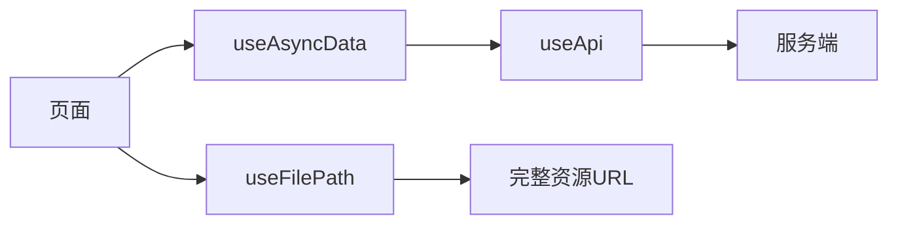

技术实现
系统采用B2C模式设计，分为以下三个端：
1、管理端：
技术栈采用Vue3生态、Vben Admin
- 用户管理（系统运营人员、客户管理）
- 商品管理（商品信息、库存、sku、3d模型，详情介绍）
- 权限管理
- 内容推广管理（文章）
2、客户端
技术栈采用基于Vue3的Nuxt框架，shadcn-vue风格样式
- 首页展示热门、推荐的宝石信息
- 搜索页面（根据宝石材质、类别、工艺、价格等维度进行筛选）
- 宝石详情页（基本信息、sku、3d模型展示、详情介绍、添加购物车）
- 订单管理
- 购物车管理
- 结算页

### 客户端实现方式

- **技术栈**：Nuxt 4、Vue 3、Pinia、VueUse、shadcn-nuxt（Reka UI + Tailwind）、Nuxt Image/Icon、vue-sonner 等（见 `package.json`）。
- **目录与职责**：
  - `app/pages/`：路由页面（首页、商品列表/详情、购物车、订单、结算、认证、个人中心、新闻、联系等）。
  - `app/components/`：通用组件（Header、Footer、Navbar、ProductCard、Swiper、Breadcrumb 等）与 `ui/` 下 shadcn 组件。
  - `app/api/`：封装服务端 API 调用（如 `getProductDetail`、`getProductList` 等）。
  - `app/composables/`：`useApi`（统一请求、解包 data、401 跳转与 toaster）、`useAuth`、`useFilePath`（资源 URL 与 fileUrl 拼接）等。
  - `app/stores/`：Pinia 商店（cart、checkout、user、config 等），配合持久化。
- **数据流**：页面通过 `useAsyncData` + API 方法拉取数据；`useApi` 使用 `apiBase`/`apiBaseServer` 区分客户端/服务端请求；图片与 3D 模型 URL 经 `useFilePath` 与 `runtimeConfig.public.fileUrl` 拼接为可访问地址。

3、服务端
- JDK 17
- SpringBoot3 提供 RESTful 风格API
- MySQL、MybatisPlus 对数据做增删改查
- Mogodb 内容推广文章、商品详情存储
- ES or MySQL多维度筛选查询
- Redis 用户登录信息缓存、热门商品统计、推荐商品统计、用户个性化推荐等
技术点实现原理
1、热门商品
行为权重
暂时无法在飞书文档外展示此内容
行为触发时 Redis 操作
浏览商品
ZINCRBY hot:product 1 productId
加购
ZINCRBY hot:product 3 productId
下单
ZINCRBY hot:product 5 productId
支付成功
ZINCRBY hot:product 10 productId
2、推荐商品
3、用户个性化推荐
4、结算（防止重复提交订单）
5、3D 模型展示

- **数据来源与约定**：商品详情接口返回 `ClientProductResponse`，内含 `product` 与 `skus`。每个 SKU 可带 `coverImage`、`modelUrl`（3D 模型地址，一般为 glb/gltf）。仅当 SKU 启用且同时存在 `modelUrl` 与 `coverImage` 时，该 SKU 参与 3D 展示（见 `app/pages/products/[id]/index.vue` 中 `modelSkus` 计算逻辑）。
- **渲染组件与库**：使用 **@google/model-viewer**（Web Components）渲染 glTF/GLB，支持相机控制、自动旋转。在 Nuxt 中通过自定义元素 `<model-viewer>` 使用，需两处配置：`nuxt.config.ts` 中 `vue.compilerOptions.isCustomElement: tag => tag === 'model-viewer'`；`vite.ssr.noExternal: ['@google/model-viewer']`，保证服务端构建能处理该依赖。
- **客户端插件与仅客户端挂载**：插件 `app/plugins/model-viewer.client.ts` 仅运行在客户端，内部 `import '@google/model-viewer'` 注册 `<model-viewer>` 自定义元素。详情页 3D 区域用 `<ClientOnly>` 包裹 `<model-viewer>`，保证只在客户端挂载与交互。
- **展示与交互流程**：商品详情页点击「3D」按钮打开全屏抽屉（FullscreenDrawer）。内容区用 `modelSkus` 与 `currentModelIndex` 决定当前模型；`<model-viewer>` 的 `src` 绑定经 `useFilePath` 处理后的 `currentModel.modelUrl`，设 `loading="eager"`、`camera-controls`、`auto-rotate`；通过 `@load`、`@error` 更新加载/失败状态。抽屉底部展示各带 3D 的 SKU 封面图，点击切换 `currentModelIndex`，`:key="currentModel.modelUrl"` 保证切换时重新挂载，切换时显示加载态直至 `load` 或 `error`。
- **模型 URL 解析**：后端返回的 `modelUrl` 可能是相对路径或完整 URL。`app/composables/useFilePath.ts` 根据 `runtimeConfig.public.fileUrl` 将相对路径拼成完整可访问 URL；已是 `http(s)://` 或 `//` 则原样返回。
- **模型格式与制作**：前端支持 model-viewer 所支持的格式（如 glb/gltf）。模型由管理端或独立工具制作/导出后上传，将 URL 写入 SKU 的 `modelUrl` 即可在详情页 3D 抽屉中展示。

部署
